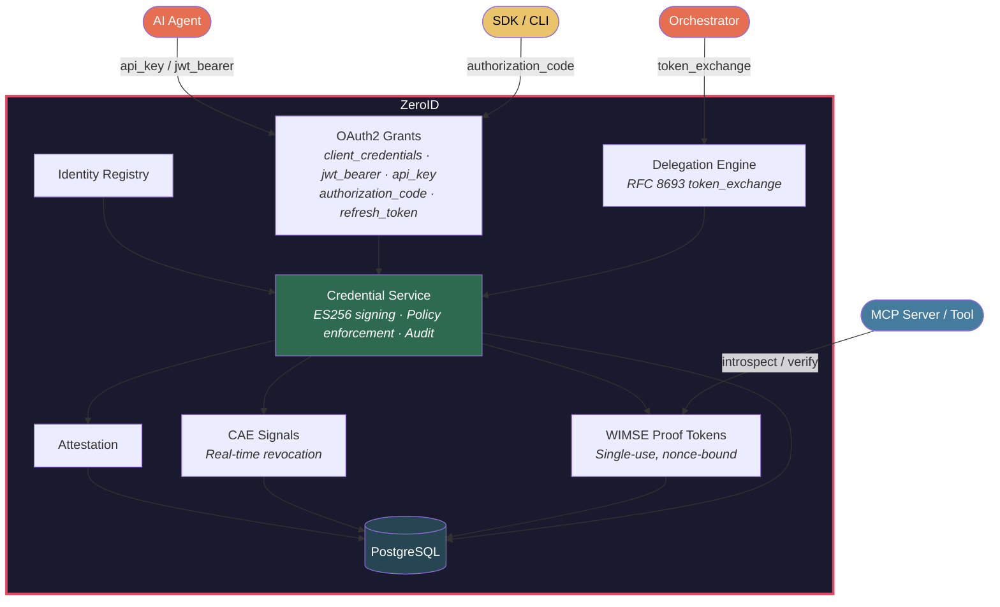

<p align="center">
  <h1 align="center">ZeroID</h1>
  <p align="center"><strong>Identity Infrastructure for Autonomous Agents</strong></p>
  <p align="center">
    Issue short-lived agent credentials · Delegate between agents · Attest · Revoke in real-time
    <br/>
    OAuth 2.1 &middot; WIMSE/SPIFFE &middot; RFC 8693 delegation &middot; Developer SDKs
  </p>
  <p align="center">
    <a href="https://github.com/highflame-ai/zeroid/actions/workflows/release.yml">
      
    </a>
    <a href="https://goreportcard.com/report/github.com/highflame-ai/zeroid">
      
    </a>
    <a href="https://github.com/highflame-ai/zeroid/releases">
      
    </a>
    <a href="https://pkg.go.dev/github.com/highflame-ai/zeroid">
      
    </a>
    <a href="https://github.com/highflame-ai/zeroid/blob/main/LICENSE">
      
    </a>
    <a href="https://discord.gg/zeroid">
      
    </a>
  </p>
</p>

---

## The Problem

When an AI agent takes an action, commits code, calls an API, or modifies a record, the question every security and compliance team asks is:

> *"Which agent did this, acting on whose authority, with what permissions?"*

Today's agents often answer this question badly—or not at all. They impersonate users via shared service accounts, creating no auditable distinction between the human who authorized the action and the agent that executed it. OAuth/OIDC tokens weren't designed for agents that spawn sub-agents, operate without humans in the loop, or need their delegation chains verified across a multi-step workflow.

The [OpenID Foundation's October 2025 whitepaper on Identity Management for Agentic AI](https://openid.net/wp-content/uploads/2025/10/Identity-Management-for-Agentic-AI.pdf) identifies this as the industry's most urgent unsolved problem: *"User impersonation by agents should be replaced by delegated authority. True delegation requires explicit 'on-behalf-of' flows where agents prove their delegated scope while remaining identifiable as distinct from the user they represent."*

**ZeroID** is the open source implementation of Agent Identity.

## What Is ZeroID

ZeroID is identity infrastructure for autonomous agents: a system that issues cryptographically verifiable credentials, enforces delegated authority through chains of agents, and revokes access in real time. Built on OAuth 2.1, WIMSE/SPIFFE, and RFC 8693, it implements the industry's emerging standards for agent identity before they become requirements.

Each agent gets a stable, globally unique identity URI. When one agent delegates to another, scope is automatically attenuated—the sub-agent can only receive permissions the orchestrator already holds, capped by the sub-agent's own policy. Every token carries the full on-behalf-of chain: who authorized it, what scope was granted, and how deep the delegation goes. Every action is attributable, cryptographically.

At Highflame, we have been using ZeroID to power our Agent Control & Governance Platform for several months now and we are contributing this to open source to further the state of the industry to solve this important problem. 

**The model:**

```
Root authority (human, policy, or orchestrator agent) authorizes Agent A
        ↓
Agent A gets a scoped credential with its WIMSE identity URI
        ↓
Agent A delegates a subset of its scope to Agent B (RFC 8693 token exchange)
        ↓
Agent B's token carries: its own identity + delegation chain + original authorizer
        ↓
Any system Agent B calls can verify the full chain cryptographically
```

The root can be a human, org policy, or another agent. Fully autonomous workflows work without anyone in the loop.

## Why Not OAuth/OIDC or Service Accounts?

OAuth 2.1 works well for Human identity, it works partially for a single agent accessing tools within one trust domain. But, the model completely breaks down the moment agents operate asynchronously, spawn sub-agents, or cross organizational boundaries. Service accounts are worse: they're shared, opaque, and leave no delegation trail at all.

|  | Service Accounts | OAuth/OIDC | ZeroID |
|---|---|---|---|
| Per-agent identity | ❌ Shared | ✅ | ✅ |
| Agent-specific metadata (type, framework, version) | ❌ | ❌ | ✅ |
| On-behalf-of (OBO) delegation chain | ❌ | ❌ | ✅ RFC 8693 |
| Scope attenuation at each delegation step | ❌ | ❌ | ✅ |
| Delegation depth enforcement | ❌ | ❌ | ✅ |
| Real-time revocation with cascade | ❌ | ❌ | ✅ CAE / SSF signals |
| Autonomous workflows (no human in the loop) | ❌ | ❌ | ✅ |
| Open source, standards-based | ❌ | Partial | ✅ |

## The Core Distinction: 
OAuth/OIDC authenticates a human to a service. **ZeroID implements true delegated authority.** Agents are distinct from the users who authorize them, and every token proves it.

## Features

- **Agent Identity Registry** — Register agents, MCP servers, services, and applications as first-class entities. Classify by role (`orchestrator`, `autonomous`, `tool_agent`), enrich with metadata (`framework`, `version`, `publisher`, `capabilities`), assign trust levels, and manage the full lifecycle: register → activate → deactivate → de-provision.
- **OAuth 2.1 Token Issuance** — Full OAuth 2.1 support: `client_credentials`, `jwt_bearer` (RFC 7523), `token_exchange` (RFC 8693) for delegation, `api_key`, `authorization_code` (PKCE), `refresh_token`.
- **On-Behalf-Of (OBO) Delegation** — RFC 8693 token exchange with automatic scope attenuation at each hop, delegation depth tracking, and cascade revocation when any upstream credential is revoked. The `act` claim carries the full chain per RFC 8693, closing the auditability gap that plagues shared service accounts.
- **WIMSE/SPIFFE URIs** — Stable, globally unique identity URIs: `spiffe://{domain}/{account}/{project}/{type}/{id}` for every agent. Tokens carry the WIMSE URI as `sub`, so every downstream system receives a meaningful, verifiable identity—not just a client ID.
- **Credential Policies** — Governance templates that enforce TTL, allowed grant types, required trust levels, and max delegation depth. Defines each agent's operational envelope programmatically, replacing per-action consent with policy-based controls.
- **Continuous Access Evaluation (CAE)** — Revoke credentials in real time when risk signals fire via the OpenID Shared Signals Framework (SSF). Revoke the orchestrator's credential and the entire downstream chain is invalidated immediately—no waiting for token expiry.
- **Attestation Framework** — Software, platform, and hardware attestation to bootstrap or elevate trust levels before credentials are issued.
- **WIMSE Proof Tokens** — Single-use, nonce-bound tokens for service-to-service verification and replay protection.

---

## Supported Agent Flows

ZeroID covers every agentic deployment pattern — from a single autonomous agent to deep multi-agent chains spanning organizational boundaries.

| Flow | Grant Type | Human in the loop? | Description |
|------|-----------|-------------------|-------------|
| **Fully autonomous agent** | `api_key` | No | Agent acts entirely on its own. Token carries `sub` (agent WIMSE URI) and `owner` (who provisioned it). `act` is absent — no user delegated this action. |
| **Human authorizes once, agent runs autonomously** | `authorization_code` (PKCE) | At registration only | A human authenticates via OAuth and authorizes the agent once. Token carries `sub` (agent WIMSE URI), `owner` (provisioner), and `act.sub` (the authorizing user's ID). Agent runs autonomously from that point. |
| **Agent acting on behalf of a user** | `jwt_bearer` (RFC 7523) | No | Agent presents a user's JWT as proof of delegated authority. Token carries `sub` (agent WIMSE URI), `owner` (provisioner), and `act.sub` (the delegating user's ID). No user interaction at request time. |
| **Orchestrator → sub-agent delegation** | `token_exchange` (RFC 8693) | No | Orchestrator delegates a subset of its own scope to a sub-agent. Sub-agent proves its identity via a signed JWT assertion. ZeroID enforces scope intersection — sub-agent cannot receive more than the orchestrator holds. |
| **Multi-hop agent chain** | `token_exchange` chained | No | Sub-agent delegates further to a tool agent (depth 2), and so on. `delegation_depth` increments at each hop. `CredentialPolicy.max_delegation_depth` caps how far the chain can go. The full `act` claim chain is preserved at every level. |
| **Service-to-service (no user context)** | `client_credentials` | No | Agent authenticates as itself with no user association. Used for background jobs, scheduled tasks, and internal services where no human delegation chain exists. |
| **Long-running / async agent** | `refresh_token` | No | Agent refreshes its access token without re-authenticating. Used for agents executing multi-day workflows where the original access token would otherwise expire. |

**Revocation works across all flows.** A single `revoke` call on any token in a chain invalidates it and everything downstream, in real time.

---

## Quick Start

**Install the SDK:**

```bash
pip install highflame        # Python
npm install @highflame/zeroid   # Node / TypeScript
```

**Run ZeroID locally** (Docker — 30 seconds):

```bash
make setup-keys              # generate ECDSA P-256 + RSA 2048 signing keys
docker compose up -d         # starts Postgres + ZeroID
curl http://localhost:8899/health
# {"status":"healthy","service":"zeroid","timestamp":"..."}
```

Or use `https://auth.highflame.ai` (hosted — [sign up free →](https://studio.highflame.ai/sign-up)).

**From source:**

```bash
make setup-keys           # generate ECDSA P-256 + RSA 2048 signing keys
docker compose up -d postgres
make run
```

---

## 5-Minute Tutorial

Examples use `http://localhost:8899`. Swap in `https://auth.highflame.ai` for hosted.

### 1. Register an Agent

Before an agent can do anything, it needs an identity. Registration creates a persistent identity record (with a WIMSE/SPIFFE URI) and issues an **API key** (`zid_sk_...`) — the agent's long-lived credential.

<details>
<summary>Python</summary>

```python
from highflame.zeroid import ZeroIDClient

client = ZeroIDClient(
    base_url="http://localhost:8899",
    api_key="zid_sk_...",  # from dashboard or registration below
)
```

</details>

<details>
<summary>Typescript</summary>

```typescript
import { ZeroIDClient } from "@highflame/zeroid";
const client = new ZeroIDClient({
  baseUrl: "http://localhost:8899",
  apiKey: "zid_sk_...",
});
```

</details>

To register a new agent programmatically:

<details>
<summary>Python</summary>

```python
agent = client.agents.register(
    name="Task Orchestrator",
    external_id="orchestrator-1",   # your internal ID for this agent
    sub_type="orchestrator",        # role: orchestrator | autonomous | tool_agent | ...
    trust_level="first_party",      # how much to trust it: unverified | verified_third_party | first_party
    created_by="dev@company.com",   # stored as owner claim in every token
)

print(agent.identity.wimse_uri)
# spiffe://auth.highflame.ai/acme/prod/agent/orchestrator-1

print(agent.api_key)
# zid_sk_...  ← save this securely, shown once
```

</details>

<details>
<summary>Typescript</summary>

```typescript
const agent = await client.agents.register({
  name: "Task Orchestrator",
  external_id: "orchestrator-1",
  sub_type: "orchestrator",
  trust_level: "first_party",
  created_by: "dev@company.com",
});
// agent.identity.wimse_uri → "spiffe://..."  (persistent identity)
// agent.api_key            → "zid_sk_..."    (save securely, shown once)
```

</details>

*Under the hood, the SDK exchanges your API key for a short-lived JWT and refreshes it automatically.*

### 2. Delegate to a Sub-Agent

When an orchestrator needs a specialized agent to handle part of a task, it delegates a **subset of its own permissions** — it cannot grant more than it has. The sub-agent gets its own token with its own identity, but the full chain of who authorized what is preserved cryptographically.

This is the key difference from sharing credentials: the sub-agent has its own registered identity and its own keypair. It proves it holds that keypair by signing a short-lived JWT assertion (`actor_token`). ZeroID verifies both tokens and issues a delegated token that carries both identities.

<details>
<summary>Python</summary>

```python
# Register the sub-agent — it has its own identity, separate from the orchestrator
sub_agent = client.agents.register(
    name="Data Fetcher",
    external_id="data-fetcher",
    sub_type="tool_agent",
    trust_level="first_party",
)

# The sub-agent proves it holds its private key by signing a JWT assertion.
actor_token = build_jwt_assertion(
    iss=sub_agent.identity.wimse_uri,
    sub=sub_agent.identity.wimse_uri,
    aud="https://auth.highflame.ai",
    private_key_pem=sub_agent_private_key,
)

# Delegate data:read to the sub-agent.
# ZeroID enforces scope intersection — the sub-agent can only receive scopes
# the orchestrator already holds.
delegated = client.tokens.exchange(
    actor_token=actor_token,
    scope="data:read",
)

# The delegated token carries the full chain:
#   sub:              spiffe://.../agent/data-fetcher   ← who is acting
#   owner:            ops@company.com                   ← who provisioned this agent
#   act.sub:          spiffe://.../agent/orchestrator-1 ← which agent delegated (RFC 8693)
#   scope:            data:read                         ← capped by intersection
#   delegation_depth: 1
```

</details>

### 3. Introspect — Verify the Full Chain

Any service that receives a ZeroID token can verify the full chain by calling introspect. This is how an MCP server, API gateway, or downstream tool answers: *"Is this token valid, who does it belong to, and on whose authority does it act?"*

<details>
<summary>Python</summary>

```python
info = client.tokens.introspect(delegated.access_token)

print(info.active)   # True — token is valid and not revoked
print(info.sub)      # spiffe://auth.highflame.ai/acme/prod/agent/data-fetcher
# Full chain is readable from the token:
#   owner            → ops@company.com               (who provisioned this agent)
#   act.sub          → spiffe://.../orchestrator-1    (which agent delegated, or user ID if human-initiated)
#   delegation_depth → 1
#   trust_level      → first_party
```

</details>

<details>
<summary>Typescript</summary>

```typescript
const info = await client.tokens.introspect(delegated.access_token);
// info.active → true/false
// info.sub    → agent's WIMSE URI
```

</details>

### 4. Revoke

Revocation is immediate and cascades. Revoke any token in the chain and everything downstream of it becomes invalid — no need to wait for expiry.

<details>
<summary>Python</summary>

```python
# Revoke a specific delegated token
client.tokens.revoke(delegated.access_token)
# → delegated token now returns active: false on introspect

# Revoke the orchestrator's token and the entire downstream chain collapses.
# This is how you respond to a compromise: one call, full containment.
client.tokens.revoke(orchestrator_token)
```

</details>

<details>
<summary>cURL</summary>

```bash
# Register (admin endpoint — requires tenant headers)
curl -X POST http://localhost:8899/api/v1/agents/register \
  -H "Content-Type: application/json" \
  -H "X-Account-ID: acme" -H "X-Project-ID: prod" \
  -d '{"name":"Task Orchestrator","external_id":"orchestrator-1","sub_type":"orchestrator","trust_level":"first_party","created_by":"dev@company.com"}'
# → {"identity":{...},"api_key":"zid_sk_..."}

# Token (public endpoint — no headers needed)
curl -X POST http://localhost:8899/oauth2/token \
  -H "Content-Type: application/json" \
  -d '{"grant_type":"api_key","api_key":"zid_sk_...","scope":"data:read data:write"}'

# Delegate (both ES256 and RS256 subject_tokens accepted)
curl -X POST http://localhost:8899/oauth2/token \
  -H "Content-Type: application/json" \
  -d '{"grant_type":"urn:ietf:params:oauth:grant-type:token-exchange","subject_token":"<orchestrator_token>","actor_token":"<sub_agent_jwt_assertion>","scope":"data:read"}'

# Introspect
curl -X POST http://localhost:8899/oauth2/token/introspect \
  -H "Content-Type: application/json" -d '{"token":"eyJ..."}'

# Revoke
curl -X POST http://localhost:8899/oauth2/token/revoke \
  -H "Content-Type: application/json" -d '{"token":"eyJ..."}'
```

Full interactive API docs: `GET http://localhost:8899/docs`
</details>

---

## Real-World Patterns

### Pattern 1: High-velocity autonomous agent with policy-based controls

**Scenario:** A marketing optimization agent receives a single instruction — *"Reallocate budget to maximize click-through rate"* — and immediately begins making hundreds of API calls: pausing underperforming campaigns, adjusting bids, transferring budget across ad groups. It operates at machine speed, completing in seconds what would take a human hours.

**The problem without ZeroID:** The agent uses a shared service account with broad CRM and ad-platform access. There is no record of which agent took which action, no limit on what it can touch, and no way to stop it if it starts behaving unexpectedly — short of revoking the shared account and breaking every other service using it.

**With ZeroID:** Define the agent's exact operational envelope once at registration time using a `CredentialPolicy`. The agent can only obtain tokens for the scopes the policy allows. It cannot delegate further. Every action carries its identity in the token `sub`, and `owner` traces it back to the team that provisioned it.

```python
# Operations team defines the envelope once — before the agent runs
policy = client.credential_policies.create(
    name="budget-optimizer-policy",
    allowed_scopes=["campaigns:read", "campaigns:write", "budget:reallocate"],
    max_ttl_seconds=3600,           # tokens expire hourly — no long-lived access
    required_trust_level="first_party",
    max_delegation_depth=0,         # this agent cannot spawn sub-agents
)

agent = client.agents.register(
    name="Budget Optimizer",
    external_id="budget-optimizer-v1",
    sub_type="autonomous",
    trust_level="first_party",
    created_by="operations@company.com",  # owner claim in every token
)

# Agent runs autonomously. Per-action approvals are replaced by the policy envelope.
# If the agent tries to request billing:write or customer:delete — ZeroID rejects the token request.
# No runtime intervention needed; the policy is the control.
token = client.tokens.issue(
    grant_type="api_key",
    api_key=agent.api_key,
    scope="campaigns:read campaigns:write budget:reallocate",
)
```

**If something goes wrong:** One call revokes the agent's token. Every downstream API using that token immediately sees `active: false` on introspection. The shared service account is untouched — other services keep running.

---

### Pattern 2: Human authorizes once, agent runs autonomously

**Scenario:** A developer connects their coding agent to their GitHub account. From that point on, the agent opens PRs, reviews diffs, and pushes commits — entirely on its own, without the developer re-authorizing each action. But when something goes wrong in production, the security team needs to know: *who is responsible for this commit?*

**The problem without ZeroID:** The agent authenticates as the developer (using their OAuth token or SSH key). There is no way to distinguish agent-authored commits from human-authored ones. If the agent is compromised, you revoke the developer's access — which also locks them out.

**With ZeroID:** The agent has its own identity. The developer's identity is captured in `owner` at registration and appears in every token the agent issues — but the agent authenticates as itself, not as the developer. The audit trail is unambiguous.

```python
# Developer registers their coding agent once — this is the authorization event
agent = client.agents.register(
    name="Code Agent",
    external_id="code-agent-alice",
    sub_type="code_agent",
    trust_level="first_party",
    created_by="alice@company.com",  # becomes owner in every token
)

# From here the agent runs autonomously.
# Alice is not involved in any individual commit, PR, or push.
token = client.tokens.issue(
    grant_type="api_key",
    api_key=agent.api_key,
    scope="repo:read repo:write",
)

# Every token the agent uses carries:
#   sub:   spiffe://auth.highflame.ai/acme/prod/agent/code-agent-alice  ← the agent acted
#   owner: alice@company.com                                             ← alice provisioned it
#   act:   (absent)  ← no specific user delegated this action at runtime

info = client.tokens.introspect(token.access_token)
# Any downstream system — GitHub, CI pipeline, audit log — can answer:
# "Which agent did this, and who is responsible for it?"
```

**If Alice leaves the company:** Deactivate her agent. Its credential is revoked. The shared GitHub OAuth token Alice used before is unaffected — but the agent's identity is cleanly terminated.

```python
client.agents.deactivate(agent.identity.id)
# All tokens issued to code-agent-alice immediately return active: false
```

---

### Pattern 3: Orchestrator delegates to a sub-agent chain

**Scenario:** A security operations agent detects an anomaly in network traffic. It cannot remediate on its own — remediation requires a separate, more privileged agent with write access to firewall rules. The orchestrator needs to hand off the investigation and response while maintaining a complete audit trail of who authorized what at each step.

**The problem without ZeroID:** The orchestrator passes its own credentials to the sub-agent, or the sub-agent has its own broad credentials. Either way, there is no record of the delegation. If the remediation agent makes a mistake, the audit trail stops at "the remediation agent did this" with no connection to the orchestrator that authorized it or the policy that govoked the chain.

**With ZeroID:** Each agent in the chain has its own registered identity. The orchestrator delegates an explicit, attenuated subset of its permissions to the investigator via RFC 8693 token exchange. The investigator does the same for the remediator. Scope cannot expand at any hop. Delegation depth is enforced by policy. The full chain is cryptographically embedded in every token.

```python
# Policy caps the chain — no agent beyond depth 2 can act
policy = client.credential_policies.create(
    name="sec-ops-policy",
    max_delegation_depth=2,
    allowed_scopes=["alerts:read", "logs:read", "logs:query", "firewall:write"],
)

# Three agents registered with separate identities
monitor  = client.agents.register(name="Security Monitor",  
                                  external_id="sec-monitor",
                                  sub_type="orchestrator",  
                                  trust_level="first_party",
                                  created_by="operations@company.com")

investigator = client.agents.register(name="Log Investigator", 
                                      external_id="log-investigator",
                                      sub_type="autonomous",    
                                      trust_level="first_party",
                                      created_by="operations@company.com")

remediator   = client.agents.register(name="Firewall Agent",    
                                      external_id="fw-remediator",
                                      sub_type="tool_agent",    
                                      trust_level="first_party",
                                      created_by="operations@company.com")

# Monitor detects anomaly → gets its token
monitor_token = client.tokens.issue(grant_type="api_key", 
                                    api_key=monitor.api_key,
                                    scope="alerts:read logs:read logs:query firewall:write")

# Monitor delegates log investigation to the investigator (depth 1)
# Scope is attenuated — investigator gets read access only, not firewall:write
investigator_token = client.tokens.issue(
    grant_type="urn:ietf:params:oauth:grant-type:token-exchange",
    subject_token=monitor_token.access_token,
    actor_token=build_jwt_assertion(investigator.identity.wimse_uri, investigator_private_key),
    scope="logs:read logs:query",    # subset of monitor's scope
)

# investigator_token claims:
#   sub:              spiffe://.../agent/log-investigator
#   act.sub:          spiffe://.../agent/sec-monitor      ← monitor delegated this
#   delegation_depth: 1
#   scope:            logs:read logs:query

# Investigator confirms breach → delegates remediation (depth 2)
remediator_token = client.tokens.issue(
    grant_type="urn:ietf:params:oauth:grant-type:token-exchange",
    subject_token=investigator_token.access_token,
    actor_token=build_jwt_assertion(remediator.identity.wimse_uri, remediator_private_key),
    scope="firewall:write",          # remediator only gets what it needs
)

# remediator_token claims:
#   sub:              spiffe://.../agent/fw-remediator
#   act.sub:          spiffe://.../agent/log-investigator  ← immediate delegator
#   delegation_depth: 2                                    ← at the cap; cannot delegate further
#   scope:            firewall:write

# Incident resolved. Revoke the monitor token — the entire chain collapses immediately.
# Investigator and remediator tokens are both invalidated. One call. Full containment.
client.tokens.revoke(monitor_token.access_token)
```

---

### Pattern 4: User delegates a task to an agent at runtime

**Scenario:** An enterprise user asks their AI assistant to *"book travel for my upcoming conference."* The assistant needs to query the user's calendar, check company travel policy, book flights, and submit an expense pre-approval — all on the user's behalf. The downstream travel and HR systems need to know this action came from Alice, not from a generic agent.

**The problem without ZTA:** The agent logs into travel and HR systems as Alice (using her OAuth token). There's no distinction between Alice booking travel herself and the agent doing it on her behalf. Alice can't revoke just the agent's access — she'd have to revoke her own session.

**With ZeroID:** Alice authenticates via the authorization_code flow and delegates to her assistant. The agent's token carries its own identity in `sub`, Alice's identity in `act.sub`, and the agent's owner (ops team) in `owner`. Downstream systems can see the full picture. Alice can revoke the agent's delegated token without affecting her own session.

```python
# Alice authenticates via authorization_code + PKCE
# Her user token is exchanged so the assistant can act on her behalf
assistant_token = client.tokens.issue(
    grant_type="urn:ietf:params:oauth:grant-type:token-exchange",
    subject_token=alice_user_token,      # alice's authorization_code-issued token
    actor_token=build_jwt_assertion(assistant.identity.wimse_uri, assistant_private_key),
    scope="calendar:read travel:book expenses:submit",
)

# The token the assistant presents to travel and HR systems carries:
#   sub:              spiffe://.../agent/travel-assistant  ← the agent is acting
#   owner:            operations@company.com               ← who provisioned the agent
#   act.sub:          alice@company.com                    ← alice delegated this task
#   scope:            calendar:read travel:book expenses:submit
#   delegation_depth: 1

# Travel system sees alice@company.com in act.sub:
#   → books in Alice's name, charges Alice's cost center
#   → audit log records: "booked by travel-assistant on behalf of alice@company.com"

# Alice decides she wants to handle this herself — revoke just the agent's token
client.tokens.revoke(assistant_token.access_token)
# Alice's own session is untouched. Only the agent's delegated access is gone.
```

---

### Pattern 5: MCP server enforcing identity at the tool boundary

**Scenario:** An MCP server exposes tools that can read files, execute queries, and write to databases. It needs to verify that any agent calling it has a legitimate identity, appropriate permissions, and hasn't exceeded its authorized delegation depth — before any tool executes.

**The problem without ZeroID:** MCP servers today typically accept any bearer token and trust the caller. There's no standard way to verify who the agent is, who authorized it, or whether it's still authorized (a token issued an hour ago may have been revoked since).

**With ZeroID:** The MCP server calls introspect on every incoming token. The response carries the full identity context — the server can enforce its own access policy based on trust level, delegation depth, scope, and sub-type, without implementing its own identity logic.

```python
# In your MCP server — called before any tool executes
def authorize_agent(bearer_token: str, required_scope: str) -> dict:
    info = client.tokens.introspect(bearer_token)

    # Token is expired or was explicitly revoked
    if not info.active:
        raise PermissionError("Token is not active")

    # Only accept agents that were provisioned with first-party trust
    if info.extra.get("trust_level") not in ("verified_third_party", "first_party"):
        raise PermissionError(f"Insufficient trust level: {info.extra.get('trust_level')}")

    # Reject agents that have already delegated too many times
    # (prevents deep chains from reaching sensitive tools)
    if info.extra.get("delegation_depth", 0) > 2:
        raise PermissionError("Delegation depth exceeds allowed limit")

    # Verify the agent has the specific scope this tool requires
    granted_scopes = set(info.scope.split())
    if required_scope not in granted_scopes:
        raise PermissionError(f"Missing required scope: {required_scope}")

    # Return identity context for logging and audit
    return {
        "agent":        info.sub,                       # spiffe://... URI
        "owner":        info.extra.get("owner"),        # who provisioned this agent
        "delegated_by": info.extra.get("act", {}).get("sub"),  # who delegated (if any)
        "trust_level":  info.extra.get("trust_level"),
    }

# Tool handler
def handle_query_database(bearer_token: str, query: str) -> dict:
    ctx = authorize_agent(bearer_token, required_scope="database:read")
    # At this point we know:
    #   - the token is valid and not revoked
    #   - the agent is trusted
    #   - it has database:read scope
    #   - it hasn't been delegated through too many hops
    log_audit(action="database:read", agent=ctx["agent"], owner=ctx["owner"],
              delegated_by=ctx["delegated_by"], query=query)
    return execute_query(query)
```

**Why this matters:** The MCP server doesn't implement any identity logic of its own. It delegates all trust decisions to ZeroID. When the Highflame team revokes a compromised agent's token, every MCP server in the ecosystem immediately rejects it — without any coordination.

---

## Architecture



**Token characteristics:**

| Flow | Algorithm | Default TTL | Subject | User Claims |
|------|-----------|-------------|---------|-------------|
| NHI (`client_credentials` / `jwt_bearer`) | ES256 | 1 hour | WIMSE URI | `owner_user_id` = registrant |
| SDK (`api_key`) | RS256 | 1 hour | WIMSE URI | `act.sub` = developer using SDK |
| Delegated (`token_exchange`) | ES256 | 1 hour | Sub-agent WIMSE URI | `act.sub` = orchestrator URI |
| CLI (`authorization_code`) | RS256 | 90 days | User ID | — |
| MCP (`authorization_code` + refresh) | RS256 | 1 hour | User ID | — |

---

## API Reference

### Public (no auth required)

| Method | Path | Description |
|--------|------|-------------|
| GET | `/health` | Health check |
| GET | `/ready` | Readiness check |
| GET | `/.well-known/jwks.json` | JWKS public keys |
| GET | `/.well-known/oauth-authorization-server` | OAuth2 server metadata |
| POST | `/oauth2/token` | Issue token (6 grant types) |
| POST | `/oauth2/token/introspect` | Token introspection (RFC 7662) |
| POST | `/oauth2/token/revoke` | Token revocation (RFC 7009) |
| GET | `/oauth2/token/verify` | Forward-auth endpoint for reverse proxies (nginx `auth_request`, Caddy `forward_auth`) |

### Admin (`/api/v1/*` — protect at network layer)

| Method | Path | Description |
|--------|------|-------------|
| POST | `/api/v1/agents/register` | Register agent (identity + credential, atomic) |
| GET | `/api/v1/agents/registry` | List agents |
| GET | `/api/v1/agents/registry/{id}` | Get agent |
| PATCH | `/api/v1/agents/registry/{id}` | Update agent |
| DELETE | `/api/v1/agents/registry/{id}` | Deactivate agent |
| POST | `/api/v1/identities` | Register identity (manual) |
| GET | `/api/v1/identities/{id}` | Get identity |
| PATCH | `/api/v1/identities/{id}` | Update identity |
| DELETE | `/api/v1/identities/{id}` | Deactivate identity |
| GET | `/api/v1/identities` | List identities |
| POST | `/api/v1/oauth/clients` | Register OAuth2 client |
| POST | `/api/v1/api-keys` | Create API key |
| POST | `/api/v1/credential-policies` | Create credential policy |
| GET | `/api/v1/credential-policies/{id}` | Get credential policy |
| PATCH | `/api/v1/credential-policies/{id}` | Update credential policy |
| POST | `/api/v1/credentials/{id}/revoke` | Revoke credential |
| POST | `/api/v1/attestations` | Submit attestation |
| POST | `/api/v1/signals/ingest` | Ingest CAE signal |
| GET | `/api/v1/signals/stream` | SSE signal stream |
| POST | `/api/v1/proofs/generate` | Generate WIMSE proof token |
| POST | `/api/v1/proofs/verify` | Verify WIMSE proof token |

Full interactive docs at `GET /docs` when running.

---

## Standards

ZeroID implements the complete stack the for production agent identity systems. No proprietary protocols.  
References: [OpenID Agentic AI](https://openid.net/wp-content/uploads/2025/10/Identity-Management-for-Agentic-AI.pdf)

| Standard | RFC / Spec | Used For |
|----------|-----------|----------|
| OAuth 2.1 | RFC 6749 + BCP | Foundational auth framework |
| JWT Profile for OAuth 2.0 | RFC 7523 | Agent JWT assertions (`jwt_bearer`) |
| OAuth 2.0 Token Exchange | RFC 8693 | Agent-to-agent delegation, `act` claim |
| Token Introspection | RFC 7662 | Credential status verification |
| Token Revocation | RFC 7009 | Credential revocation |
| PKCE | RFC 7636 | Authorization code flow |
| JSON Web Tokens | RFC 7519 | Token format |
| JSON Web Key Sets | RFC 7517 | Public key distribution |
| WIMSE / SPIFFE | IETF Draft | Agent workload identity URIs |
| Shared Signals Framework (SSF) | OpenID SSF | Real-time revocation event propagation |
| CAEP | OpenID CAEP | Continuous access evaluation signals |

---

## Roadmap

- SDKs ([Python](https://github.com/highflame-ai/highflame-sdk/tree/main/python), [TypeScript](https://github.com/highflame-ai/highflame-sdk/tree/main/javascript), [RUST](https://github.com/highflame-ai/highflame-sdk/tree/main/rust))
- CIBA (Client-Initiated Backchannel Authentication) for async human-in-the-loop approvals — agents pause long-running workflows and request out-of-band user authorization without blocking
- Human-in-the-loop approval workflow (`/api/v1/approvals`)
- Ecosystem integrations (langgraph, crewai...)
- MCP server middleware
- `zeroid` CLI 

---

## Community

**Discord**: [Join the ZeroID community](https://discord.gg/zeroid) — the fastest way to get help, share what you're building, and shape the roadmap.

**ZeroID Working Group**: We are forming a working group of practitioners building agent infrastructure at scale. If you are deploying agents in production and have opinions on how identity should work, [reach out](mailto:zeroid@highflame.ai).

**GitHub Discussions**: Use [Discussions](https://github.com/highflame-ai/zeroid/discussions) for design questions, RFC proposals, and integration patterns.

**Contributing**: See [CONTRIBUTING.md](CONTRIBUTING.md). Good first issues are labeled [`good-first-issue`](https://github.com/highflame-ai/zeroid/issues?q=label%3Agood-first-issue).

---

## License

Apache License 2.0 — see [LICENSE](LICENSE) for details.

---

*ZeroID is open source infrastructure from [Highflame](https://highflame.ai) — the Agent Control Platform for enterprise AI.*
