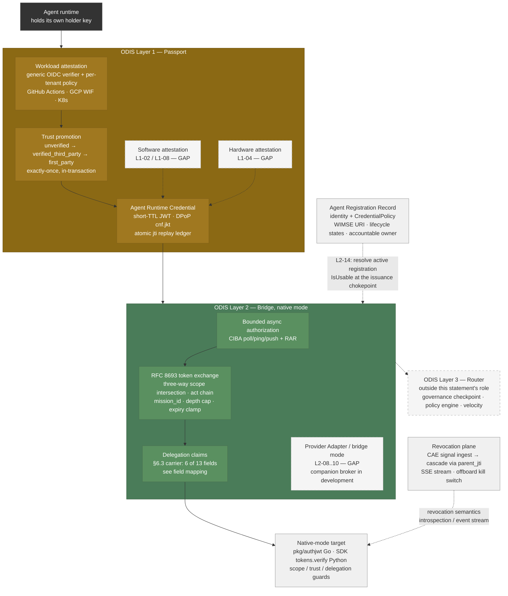

# ZeroID — ODIS Role-Capability Statement (Layers 1–2, Native Mode)

**Status**: Draft for submission to the CoSAI/OASIS WS4 ODIS workstream
**ODIS reference**: [ODIS.md draft](https://github.com/cosai-oasis/ws4-odis/blob/main/RFCs/ODIS.md) (unapproved contributor draft)
**ZeroID version**: commit `1676b4f` on `main` (PR #304 merged — `token.require_dpop`, attestation trust-clamp, CIBA credential anchoring; Apache-2.0, <https://github.com/highflame-ai/zeroid>)
**Claim type**: role-capability statement per ODIS §8. **This is not an ODIS Core, Extended, or Safety profile claim** — §8 reserves those for a complete conformance target, and this document itself identifies unmet MUSTs.

ZeroID is an OAuth 2.1/OIDC authorization server for AI-agent identity, built
independently of ODIS and mapped to it after the fact. It implements the
substance of ODIS **Layer 1 (Passport)** and **Layer 2 (Bridge, native mode)**:
registration records, attestation-gated short-lived proof-of-possession
credentials, delegation records with monotonic attenuation, asynchronous human
authorization, cascade revocation, and dual-identity audit. It does not
implement Layer 3 governance (checkpoint/policy-engine/velocity), bridge-mode
provider adapters, or software/hardware attestation; those are marked **Gap**
below, not argued around.

## How to read this

- **Meets** — the requirement's normative substance is implemented and tested.
- **Meets (via configuration)** — a supported configuration of shipped code
  fully satisfies the MUST; the note names the exact configuration. ODIS §8
  grades a *configured conformance target*, not a source tree, so this is a
  full Meets for any deployment that adopts the named posture.
- **Partial** — implemented with a stated limitation that matters.
- **Gap** — not implemented in the open-source core. Where ZeroID exposes a
  deliberate **extension point** for the capability (verifier registry,
  notifier hooks, resolver interfaces), the note names it — a deployer or a
  commercial distribution can build there, but per §8 an unbuilt extension
  carries no conformance evidence, so the verdict stays Gap until code exists.
- **N/A** — the requirement governs a component ZeroID does not contain (stated, not skipped).
- **Evidence** — repo-relative paths and greppable test names. Every pointer in
  this document was verified against the commit above; run
  `go test ./tests/integration/ -run <TestName>` to reproduce any of them
  (see `tests/integration/COMPLIANCE.md` for the per-RFC matrix).

Companion: [`examples/odis/`](../../examples/odis/) — an executable notebook
that walks ODIS terminology (Agent Registration Record → Agent Runtime
Credential → Delegation Record → revocation → audit) against a locally running
ZeroID, with real outputs committed.

## Summary

| Layer | Meets | Partial | Gap | N/A |
|---|---|---|---|---|
| L1 — Identity & Attestation (12 reqs) | 9 | 0 | 3 | 0 |
| L2 — Delegation & Access (15 reqs) | 6 | 4 | 3 | 2 |
| L3 — Discovery & Governance (declared out of role; 8 reqs) | 1 | 3 | 4 | 0 |
| CC — Cross-cutting (7 reqs) | 4 | 0 | 2 | 1 |

The Gap column is the point of publishing: it is implementation feedback on
which ODIS requirements are the real adoption cliff for an OAuth-native
authorization server (software attestation, bridge mode, presenter isolation,
published benchmarks).

## The map, in ODIS's own figure

The diagram mirrors the ODIS §3 three-layer architecture figure (same shape,
same layer palette) with ZeroID's components in the boxes. Solid boxes are
implemented, with evidence in the tables below; dashed boxes are the declared
gaps or out-of-role layers.

## Layer 1 — The Passport (Identity & Attestation)

| Req | Verdict | Evidence | Notes |
|---|---|---|---|
| **ODIS-L1-01** Secret-Zero Elimination | **Meets (via configuration)** | Private-key flows: RFC 7523 jwt-bearer (`tests/integration/jwt_bearer_compliance_test.go`), DPoP (`pkg/dpop/`). Static path: `internal/service/oauth.go` `apiKeyGrant`, `domain/credential.go` `GrantTypeAPIKey` | The conformant posture is one policy line: a `CredentialPolicy` whose `AllowedGrantTypes` excludes `api_key` leaves only private-key flows (jwt-bearer, token exchange) on the agent path — fully satisfying the MUST for that deployment. The static `api_key` grant remains in `domain.DefaultAllowedGrantTypes()` as a bootstrap convenience; out-of-the-box defaults are not the conformance target. |
| **ODIS-L1-02** Software Attestation | **Gap** | `domain/attestation.go` declares `image_hash`; only `internal/attestation/stub.go` `DevStubVerifier` backs it | No digest/signature/provenance verification ships in the core (no sigstore/in-toto/SLSA integration). The deliberate extension point exists: the `internal/attestation` `Verifier` registry dispatches by proof type, and `image_hash` is reserved for exactly this — a deployer or distribution binds a real provenance verifier there without core changes. |
| **ODIS-L1-03** Runtime/Workload Attestation | **Meets** | `internal/attestation/oidc.go` (generic `OIDCVerifier`: JWKS discovery, issuer allow-list, audience, `required_claims`, SSRF-guarded transport); per-tenant `AttestationPolicy` (`internal/attestation/policy.go`); fail-closed: `TestAttestationFailsClosedWithNoPolicy`, `TestAttestationOIDCVerifierRejectsUntrustedIssuer`, `TestAttestationDoubleVerifyIsRejected` | One generic OIDC verifier; GitHub Actions, GCP Workload Identity Federation, and Kubernetes projected SA tokens are worked *configurations* (`docs/attestation.md`), not per-provider code. |
| **ODIS-L1-04** Hardware Attestation | **Gap** | `tpm` proof type exists; stub-only | Same status and same extension point as L1-02: bind a TPM/TEE verifier into the registry. |
| **ODIS-L1-05** Credential Lifecycle | **Meets** | `domain/credential_policy.go` (`MaxTTLSeconds`, default 3600), enforcement `internal/service/credential_policy.go` `EnforcePolicy`; child exp clamped to parent (`TestTokenExchangeChildClampedToParentExpiry`); refresh rotation with reuse-detection family revocation (`tests/integration/refresh_token_race_test.go`) | Lifetimes are configurable, finite, policy-bounded. Automatic rotation before expiry is enforced by the SDK component of the declared target: the token manager refreshes ahead of expiry via a built-in buffer (`highflame/zeroid/_token_manager.py`, `_TOKEN_REFRESH_BUFFER`), with the server re-gating identity state and current policy on every rotation. |
| **ODIS-L1-06** Provisioning & De-provisioning | **Meets** | Lifecycle states `discovered→pending→active→suspended→deactivated/expired` (`domain/identity.go` `CanTransitionTo`); adopt/dismiss (`internal/handler/identity.go`); offboard-by-owner cascade (`internal/service/identity.go` `OffboardOwner`, DB `revoke_credentials_by_owner_cascade`); `tests/integration/discovery_lifecycle_test.go` | Satisfied via the "equivalent lifecycle-management mechanisms" clause — SCIM protocol endpoints themselves are not implemented. |
| **ODIS-L1-07** Federated Trust *(Extended)* | **Meets** | Direct external-issuer OIDC federation: `external_issuers` config (`domain/external_issuer.go`), verification `internal/service/oauth_external_idp.go` (`subject_token_type=…:id_token`), upstream `iss` propagated as `user_id_iss`; `TestExternalIDTokenFederation_EndToEnd`, `_KeyRotation`, `_CrossTenantRejected` | Deployer-configured trust anchors; no automatic federation discovery. A trusted-service broker path also exists (`ExternalPrincipalExchange`) and is documented as the lossier fallback. |
| **ODIS-L1-08** Trusted Distribution | **Gap** | — | No supply-chain verification before identity issuance. Pairs with L1-02. |
| **ODIS-L1-09** Holder-of-Key Authentication | **Meets (via configuration)** | DPoP with atomic jti replay ledger (`pkg/dpop/verifier.go`, `TestDPoPReplayRejected`); refresh tokens key-bound (`TestDPoPRefreshBoundWithDifferentKeyRejected`); binding propagates through delegation (`TestDPoPTokenExchange_PropagatesBindingToSubAgent`); WIMSE single-use nonce-bound proof tokens (`internal/service/proof.go`); **enforcement switch**: `token.require_dpop` refuses proof-less issuance with `invalid_dpop_proof` on every grant and advertises `dpop_bound_access_tokens_required` per RFC 9449 §5.1 (`TestRequireDPoPRefusesProoflessIssuance`, `TestRequireDPoPAdvertisedInASMetadata`) | The conformant posture is `token.require_dpop: true` (default off preserves Bearer opt-in): every issued credential is then proof-of-possession-bound. Client-side note: the Python SDK (0.3.17) does not yet construct DPoP proofs (tracked upstream, sdk#105), so a require_dpop deployment currently serves raw-HTTP/self-signing clients — the notebook demonstrates proof construction in a few lines of PyJWT. Consequently the SDK companion notebook runs under the default `require_dpop: false`; each notebook's required configuration is stated in `examples/odis/README.md`. |
| **ODIS-L1-10** Accountable Sponsor | **Meets** | `owner_user_id` verified against the tenant directory (CAP-DSC-004, `internal/service/identity.go`); offboard-by-owner cascade; ownerless as a surfaced posture signal | ODIS's administrative *drain* state is not implemented — lifecycle events revoke rather than drain. |
| **ODIS-L1-11** Attestation-Bootstrapped Trust | **Meets (via configuration)** | Attestation raises `trust_level` exactly-once in-transaction (`internal/service/attestation.go` `trustLevelForAttestation`); `CredentialPolicy.RequiredTrustLevel`/`RequiredAttestation` gate issuance (`EnforcePolicy` checks 4–5); expiry demotes (`TestExpiredAttestationNoLongerSatisfiesPolicy`) | The conformant posture: `RequiredTrustLevel`/`RequiredAttestation` on the identity's `CredentialPolicy` makes issuance depend on verified attestation, fail-closed (demonstrated live in the companion notebook, §3–§4). Tenants that omit the requirement have chosen a non-ODIS posture; the enforcement machinery is shipped and tested. |
| **ODIS-L1-12** Runtime Security State | **Meets** | Signal ingest `POST /signals/ingest` (`internal/handler/signal.go`); severity-driven revocation with cascade (`TestCAECriticalSignalRevokesCredential`, `TestCAESignalCascadesRevocationToChildren`) | Signal schema is ZeroID-local, not CAEP event-type URIs (see `COMPLIANCE.md`'s honest SSF/CAEP row). |

## Layer 2 — The Bridge (Delegation & Access, native mode)

| Req | Verdict | Evidence | Notes |
|---|---|---|---|
| **ODIS-L2-01** Delegated Authorization | **Partial** | Three-way scope intersection at exchange (`internal/service/oauth.go` `tokenExchange`: requested ∩ subject-granted ∩ actor-policy); empty intersection fails closed (`invalid_scope`) | Partial under a strict reading: the MUST enumerates the intersection's inputs as principal ∩ registration ∩ parent ∩ **task ∩ resource ∩ environmental constraints** ∩ adapter mapping. ZeroID intersects scopes/depth/TTL, resolves the registration, clamps to the parent, and re-verifies the principal on refresh — but models no task/resource/constraint dimensions. Fail-closed behavior itself is complete. |
| **ODIS-L2-02** Bounded Authorization | **Meets** | CIBA poll/ping/push (`internal/service/backchannel.go`, `TestCIBACore1_0_S11_AuthorizationPendingWhilePending`); RAR typed `authorization_details` bound into the approval and the issued JWT (`TestRFC9396_S6_1_AccessTokenJWTEmbedsAuthorizationDetails`, `ciba_rar_test.go`) | Async human approval bound to the request's declared authority — ODIS's headless-agent clause implemented with standard protocols. |
| **ODIS-L2-03** Session Continuity | **Meets** | Refresh re-gates identity usability before *and* after rotation (`internal/service/oauth.go` `refreshTokenGrant`); DPoP binding re-checked; reuse detection revokes the family (`refresh_token_race_test.go`) | Fail-closed on revocation, deactivation, expiry, or binding mismatch. |
| **ODIS-L2-04** Durable Delegation *(Extended)* | **Meets** | Refresh tokens with rotation + reuse-detection (`refresh_token_race_test.go`); every refresh re-gates identity state and re-runs current policy | This is the SHOULD's substance: a pre-authorized window in which authority auto-renews without new human interaction, bounded by lifecycle state, policy, and revocation — the window construct is the refresh-token family. |
| **ODIS-L2-05** Delegation Record | **Partial** | `act` chain (`domain/token.go` `ActorClaims`, `TestRFC8693_S4_2_ActClaimChainsDelegation`), `parent_jti`, `mission_id` lineage (`TestMissionID_ChainPropagation`), `delegation_depth`, child expiry clamped to parent | Carried as JWT claims (§6.3 permits any integrity-protected carrier; integrity = the AS signature), but several §6.3 MUST fields have no equivalent — see the field mapping below the table. |
| **ODIS-L2-06** Authorization Attenuation | **Partial** | Monotonic narrowing via set intersection over a controlled scope vocabulary; depth cap; `TestRFC8693_*` + `subagent_delegation_test.go` | This is lexical-with-controlled-vocabulary, not the semantic `attenuation_profile_ref` mechanism ODIS specifies. Honest reading: sufficient when the issuer owns the vocabulary, insufficient for cross-vendor scope semantics. |
| **ODIS-L2-07** Contextual Re-verification | **Meets** | Pre-rotation identity gate + full `EnforcePolicy` re-run against *current* policy on every refresh (`refreshTokenGrant`; `deactivation_test.go`) | |
| **ODIS-L2-08** Backward Compatibility (bridge) | **Gap** | — | ZeroID is native-mode only: downstream services validate ZeroID JWTs (`pkg/authjwt`). Target-native credential translation is a companion credential-broker component under development, out of this statement's scope. |
| **ODIS-L2-09** Bridge Mapping | **Gap** | — | With L2-08. |
| **ODIS-L2-10** Fail-Closed Attenuation (bridge) | **Gap** | — | With L2-08. |
| **ODIS-L2-11** Revocation-Safe Credential Reuse | **N/A** | Within its own token plane: cascade revocation + `RevocationNotifier` fire per-JTI (`TestRevocationNotifier_FiresOncePerJTIOnCascade`) | ZeroID does not cache derived downstream credentials, so the reuse-TTL bound has no object here; it binds the (future) broker component. |
| **ODIS-L2-12** Presenter Continuity | **Meets** | Same-key enforcement across the credential's whole life: refresh rotation rejects a different holder key (`TestDPoPRefreshBoundWithDifferentKeyRejected`), refresh without proof rejected (`TestDPoPRefreshBoundWithoutProofRejected`), and the binding propagates through delegation (`TestDPoPTokenExchange_PropagatesBindingToSubAgent`) | The requirement is conditional ("*when* Layer 2 issues a holder-of-key-bound credential") and ZeroID enforces exactly its substance for every bound credential: no key substitution, no export-and-rebind without re-issuance. Key custody location is L2-13/Pattern-4 territory, not this row. |
| **ODIS-L2-13** Presenter Authority Scoping | **Partial** | The WIMSE proof service is the non-generic presenter primitive the MUST describes: fixed claim shape (never arbitrary payloads), audience-bound, single-use via DB-unique nonce, and identity-state-gated before construction (`internal/service/proof.go` — `IsUsable`/expiry checked before signing; `TestProofTokenSingleUseUnderConcurrency`) | What's missing: action-level validation against the delegation record's authority, and routing DPoP proof construction through a scoped presenter — today DPoP proofs are client-constructed with directly-held keys (Pattern 4). This is exactly the surface ODIS's pending CT-P4 suite exists for — feedback for the WG: SDK-first implementations need it defined. |
| **ODIS-L2-14** Agent Registration Resolution | **Meets** | `Identity.IsUsable()` gates 15 call sites including the issuance chokepoint (`internal/service/credential.go`); `discovered` rows are inert inventory by construction (`domain/identity.go`, `discovery_lifecycle_test.go`) | ODIS's "resolve to an *active* registration before authority" is structural here, not a check bolted on. |
| **ODIS-L2-15** Provider Adapter Egress Mode | **N/A** | — | No adapters; native mode implicit. |

### §6.3 Delegation Record — field-by-field against ZeroID's claims

| §6.3 MUST field | ZeroID equivalent | Status |
|---|---|---|
| `delegation_id` | `jti` | present |
| `issuer` | `iss` (the AS) | present |
| `parent_delegation_ref` | `parent_jti` — but no `record_digest`; the parent is resolved by ID, digest-matching is not performed | partial |
| `originating_principal` | `act.sub` / `owner_user_id` when a human roots the chain | partial (machine-rooted chains carry no distinct originating principal) |
| `originating_authorization_ref` | — | absent |
| `actor` | `sub` (WIMSE URI) | present |
| `delegation_chain` | single-level `act` + reconstruction via `/delegations/by-jti` — the record itself does not carry the ordered hop list | partial |
| `task_id` | `mission_id` — a chain **correlation** key, not a declared purpose | partial (see zeroid#222: link mission_id to human-authored intent) |
| `granted_authorizations` | `scope` after intersection | present |
| `resource_indicators` | — (RFC 8707 `resource` unsupported; open zeroid#258) | absent |
| `constraints` | — | absent |
| `attenuation_profile_ref` | — (the L2-06 gap) | absent |
| `issued_at` / `expires_at` | `iat` / `exp`, child clamped to parent | present |

This mapping is offered to the workstream as implementation feedback: an
OAuth-native carrier gets 6 of 13 fields for free, 3 partially, and the 4
absent ones (`originating_authorization_ref`, `resource_indicators`,
`constraints`, `attenuation_profile_ref`) are exactly the fields with no
established OAuth claim to inherit — candidates for a minimal JWT claim
profile the spec could publish.

## Layer 3 — The Router (outside this statement's role, stated anyway)

| Req | Verdict | Evidence / note |
|---|---|---|
| ODIS-L3-01 Tool/Service Discovery | **Partial** — observed-resource registry learned from ID-JAG redemptions, deliberately evidence-not-assertion (`internal/handler/observed_resources.go`) |
| ODIS-L3-02 Governance Checkpoint | **Gap** — belongs to a gateway/router component, not the AS |
| ODIS-L3-03 Velocity Limits | **Gap** — a dormant `rate_limit_rps` column exists and is read nowhere; CIBA `slow_down` is protocol pacing, not rate limiting |
| ODIS-L3-04 Revocation Latency | **Partial** — the *mechanism* is synchronous cascade in-transaction + SSE push (`GET /signals/stream`) + `RevocationNotifier` hooks; a declared, measured maximum latency (what ODIS actually requires) is not published — see CC-03 |
| ODIS-L3-05 Kill Switch | **Meets** — identity deactivation and offboard-by-owner cascade-revoke all credentials in one operation (`revoke_credentials_by_owner_cascade`, `TestCAESignalRevokesAllActiveCredentials`) |
| ODIS-L3-06 Policy Engine Integration | **Gap** — no OPA/Cedar callout in ZeroID's request path; ID-JAG maps IdP claims into Cedar-shaped principal attributes for *downstream* engines (`oauth_id_jag.go`), which is claim shaping, not checkpoint integration. The §6.4 object itself is assemblable from existing APIs — see the inter-layer payload appendix |
| ODIS-L3-07 Task-Bound Tokens *(Extended)* | **Partial** — `mission_id` (delegation-tree purpose anchor) and RAR `authorization_details` carry declared intent in the token; no checkpoint validates actions against it inside ZeroID |
| ODIS-L3-08 Boundary Protection *(Extended)* | **Gap** — with L3-02 |

## Cross-cutting

| Req | Verdict | Evidence | Notes |
|---|---|---|---|
| **ODIS-CC-01** Observability | **Meets** | Identity audit tables + trigger (`migrations/010`, `012`); delegation explorer `/delegations/graph`, `/by-jti/{jti}`, `/chains` (`internal/handler/delegation.go`, 33 tests incl. `TestDelegationByJTI_WalksToRoot`); credentials retained past expiry on a dual-clock sweeper (`internal/worker/cleanup.go`) so lineage survives for forensics | Audit logs are not hash-chained (a SHOULD; MUST only in the Safety profile). |
| **ODIS-CC-02** Dual-Identity Audit Trail | **Meets** | Tokens carry agent `sub` + `act.sub` (originating human — preserved even through key rotation, commit `220321f`) + `owner_user_id`; `TestRFC8693_S4_2_ActClaimChainsDelegation` | |
| **ODIS-CC-03** Latency Budget | **Gap** | No `Benchmark*` functions, no published p50/p95/p99 report anywhere in-repo | ODIS requires a *published, reproducible* benchmark report; none exists. |
| **ODIS-CC-04** Availability | **Gap** | No published availability objective/measurement | With CC-03. |
| **ODIS-CC-05** Governed Identity Creation | **Meets** | Registration via authenticated admin surface; discovered rows require human adopt before usability; agents cannot mint or expand their own registration (`AdoptIdentity`, transition matrix) | |
| **ODIS-CC-06** Terminal Exchange Audit Anchor | **N/A** | ID-JAG redemptions record observed resources with single-use jti enforcement (`internal/store/postgres/id_jag_jti.go`) | Terminal exchange into non-ODIS systems is the broker component's obligation, not the AS's. |
| **ODIS-CC-07** Data Protection | **Meets** | Query strings stripped from access logs (`logSafePath`, `log_redaction_test.go`); OAuth error-value redaction on token/introspect/revoke/bc-authorize (`internal/handler/routes.go` `redactErrorValues`); raw connector/API secrets never persisted (hashed/ referenced); configurable audit retention with deletion sweeper | |

## Appendix — the inter-layer payload contract (§6.1 / §6.2 / §6.4)

ODIS mandates no wire format ("JWT claims, protocol buffers, JSON-LD" are all
valid carriers) but does mandate what each layer hands the next: the Passport
emits an Agent Runtime Credential Descriptor (§6.2) that must reference the
Agent Registration Record (§6.1); the Bridge emits the Delegation Record
(§6.3 — mapped field-by-field above); and the governance checkpoint must be
fed the assembled Identity Context (§6.4), which bundles all three plus the
requested action. Each payload carries an authenticated back-reference to the
one before it. This appendix maps the remaining two.

A note on field names: §6's schemas are **abstract** — a `credential_id` row
matched to `jti` below is not a mismatch but a *binding*, per the spec's own
carrier rule. What the spec requires is the field's semantics
("collision-resistant identifier for this Agent Runtime Credential"), and
RFC 7519's `jti` is the registered JWT claim carrying exactly those
semantics. ZeroID's bindings are documented normatively in its claim
registry (`docs/spec/zeroid-oauth-extensions.md` §14). The interoperability
risk sits one level up: ODIS publishes no canonical JWT binding, so two
conformant implementations could bind the same abstract field to different
claims — see feedback item 3.

### §6.2 Agent Runtime Credential Descriptor — field-by-field

| §6.2 field | ZeroID equivalent | Status |
|---|---|---|
| `credential_id` | `jti` | present |
| `format_version` | — (RFC 9068 `at+jwt` typ header is open work, zeroid#189) | absent |
| `agent_id` | `sub` (WIMSE URI) | present |
| `registration_record_ref` (issuer + id + version + digest) | registration resolved by authoritative same-database lookup at issuance *and* refresh (`IsUsable()` chokepoint) — within a single trust domain this is strictly stronger than a digest reference (always-current, no staleness window). The portable versioned ref matters only for cross-domain verification (federation), which is not this binding's deployment shape | present (co-located binding) |
| `runtime_instance_id` | — (ZeroID models the logical agent; per-issuance `jti` is the closest analogue) | absent |
| `software_hash` | — (the L1-02 gap, carried into the payload) | absent |
| `attestation_evidence[]` | `attestation_records` exist server-side and gate trust, but no evidence object is carried in or referenced by the credential | absent |
| `issuer` / `issuer_key_ref` | `iss` / JOSE `kid` against the published JWKS | present |
| `holder_key_ref` | `cnf.jkt` when DPoP-bound | present under the `token.require_dpop` posture (every credential bound); opt-in with Bearer fallback otherwise |
| `issued_at` / `expires_at` | `iat` / `exp` | present |
| `trust_domain` | the WIMSE URI's trust-domain segment | present |
| `supply_chain_ref` *(SHOULD)* | — | absent |
| `audiences` | `aud` — defaults to the issuer; RFC 8707 resource binding is open work (zeroid#199/#258) | partial |

### §6.4 Identity Context — assembly feasibility

ZeroID emits no assembled §6.4 object (the L3-06 Gap above). The raw material
is another story — nearly every field already exists behind an API:

| §6.4 field | ZeroID raw material | Status |
|---|---|---|
| `agent_registration` (§6.1 object) | `GET /identities/{id}` + its `CredentialPolicy` | data exists, unassembled |
| `agent_runtime` (§6.2 descriptor) | RFC 7662 introspection (`act`, `cnf`, `trust_level`, `delegation_depth`, `authorization_details`) | data exists, §6.2 gaps carry over |
| `delegation` (§6.3 record) | `GET /delegations/by-jti/{jti}` — lineage, scopes in/out, attenuation, revocation | data exists (partial per the §6.3 mapping) |
| `action` {tool, method, resource, parameters} | supplied by the governance checkpoint at call time, not the AS | checkpoint-side by design |
| `request_timestamp` | checkpoint-assigned per §6.4 ("MUST NOT rely solely on a timestamp supplied by the agent") | checkpoint-side by design |
| `request_trace_id` | server-side `request_id` in logs only; nothing end-to-end in the token or introspection | gap |
| `runtime_risk_signals[]` | `GET /signals` (CAE signal store, typed + severities) | data exists |

**The integration seam this exposes:** a read-only
`GET /identity-context/{jti}` that joins what ZeroID already stores would make
it the first implementation emitting §6.4 — and that object is precisely the
input the ODIS contract harness's Router/OPA checkpoint wants to be fed. One
endpoint turns "ZeroID = Layers 1–2" and "harness = Layer 3" into a running
three-layer ODIS stack.

## Feedback to the ODIS workstream (what this mapping surfaced)

1. **The adoption cliff is L1-02/L1-08 + L2-08..10 + L2-13.** An OAuth-native
   AS can meet the identity, delegation, lifecycle, revocation, and audit
   requirements of Layers 1–2 with standard protocols (RFC 7523/8693/9396/9449,
   CIBA, SPIFFE-style naming). Software/supply-chain attestation, bridge-mode
   translation, and presenter isolation are each a separate engineering
   program. Sequencing guidance in the spec (which Core MUSTs make a useful
   Phase-1) would materially help implementers.
2. **CT-P4 is load-bearing.** Every SDK-first implementation lands in
   deployment Pattern 4; until the CT-P4 suite exists, none can claim Core
   regardless of how much else they meet. Defining it should be a priority —
   we volunteer as a test subject.
3. **Publish a canonical JWT binding for §6.2/§6.3, and a minimal
   attenuation profile for L2-06.** The schemas are abstract by design, but
   with no canonical claim binding, two conformant implementations can bind
   the same field to different claims (`credential_id` → `jti` here; a
   custom claim elsewhere) and verifiers cannot converge — a short
   abstract-field → registered-JWT-claim table would fix it. Likewise
   L2-06's `attenuation_profile_ref` has no example profile anywhere; our
   lexical-with-controlled-vocabulary intersection is what implementers
   build first, and a canonical minimal profile (exact-match over a
   registered vocabulary) would let such implementations declare themselves
   precisely.
4. **agent_id vs runtime instance** (their issue #6): ZeroID's split — stable
   logical identity + WIMSE URI, per-issuance short-lived credentials with
   per-JTI lineage — is a working answer to the uniqueness question and is
   documented in `docs/spec/zeroid-oauth-extensions.md` §14 (claim registry).
5. **Platform-credential verifiability** (their issue #5): the
   `AttestationPolicy` shape (per-tenant issuer allow-list + `required_claims`
   + audience, one generic OIDC verifier) is a concrete data model for the
   verification-method metadata that issue asks about.
6. **The §6.4 Identity Context is the natural join point between
   implementations.** ZeroID holds nearly every §6.4 field behind existing
   APIs (see the appendix); a single read-only assembly endpoint would emit
   the first real §6.4 object — and feed it straight into the contract
   harness's Router/OPA checkpoint for an end-to-end three-layer
   demonstration. We propose building exactly that as the first joint
   artifact.

## Known hardening items surfaced while writing this statement

Recorded here for honesty; tracked in the ZeroID issue tracker:

- `attestation.allow_unsafe_dev_stub` currently defaults to **true**, wiring a
  stub verifier for the `image_hash`/`tpm` proof types (the OIDC verifier is
  never stubbed). The default should flip to false.
- `service_keys.rate_limit_rps` exists in schema and domain but is read
  nowhere (relates to L3-03).
